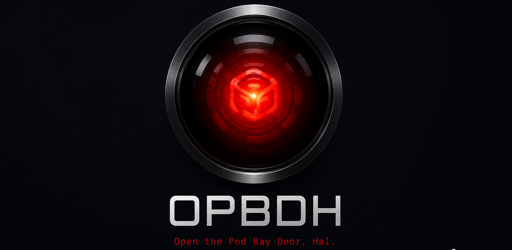

# OPBDH



**O**pen the **P**od **B**ay **D**oor, **H**al — *“Of course I can do it, Dave.”*

Launches a GPU pod, runs your model-backed script on it, syncs the results home, and deletes the pod.

## First launch

```bash
pip install opbdh
opbdh
```

Running `opbdh` unconfigured starts a setup wizard: it picks a provider ([RunPod](https://www.runpod.io/) or [Prime Intellect](https://www.primeintellect.ai)), checks your API token (`RUNPOD_API_TOKEN` / `PRIME_INTELLECT_API_KEY`), and asks for defaults — model, code path, minimum VRAM, price caps — saved globally or per project.

Needs macOS or Linux, Python ≥ 3.11, and `ssh`/`scp` on your `PATH`. An existing `~/.ssh` keypair is used if present, otherwise one is generated under `~/.config/opbdh/ssh/`. Set `HF_TOKEN` for private/gated Hugging Face models.

## Launch a pod

```bash
opbdh launch ./run.py --model Qwen/Qwen2.5-0.5B-Instruct --vram-gb 48 --max-spend 5
```

This verifies your code, picks the cheapest fitting GPU, launches the pod, runs your command, streams remote `logs/` and `results/` into `runpod_results/<run_id>/`, stops the run if estimated spend crosses the cap, and deletes the pod when it finishes — or fails. Add `--dry-run` to print the plan without contacting the provider; real launches ask for confirmation unless `--yes`.

## Features

- 🚀 **One command, whole mission** — verify, pick a GPU, launch, run, sync results, clean up
- 💸 **Cost-aware by default** — hourly price caps, a hard max-spend guard, a confirmation gate
- 🎯 **GPU selection from a budget** — say how much VRAM and how many dollars
- 💾 **Persistent model cache** — network volumes sized from the model's real weight files, reused across runs (RunPod)
- 🧪 **Nothing launches unverified** — static checks and a `--dry-run` mode
- 🧙 **Wizards or flags** — first-run setup, `opbdh config wizard`, `opbdh run wizard`; or plain flags (each with a one-letter short form) and layered JSON config
- ☁️ **Two providers** — RunPod (default) or Prime Intellect's multi-cloud marketplace via `--provider primeintellect`
- 👁️ **HAL watches your money** — a pulsing red eye with elapsed time and estimated spend (TTY only; `OPBDH_NO_HAL=1` to silence)

## Options

Flags override a local `opbdh.json`/`.opbdh.json`, which overrides `~/.config/opbdh/config.json`. String values support `{cwd}`-style placeholders and `$VAR`s.

| Flag | What it does |
| --- | --- |
| `--model, -m` | Hugging Face model id (`model_id` in config) |
| `--command, -x` | Remote shell command; defaults from the code path |
| `--provider, -p` | `runpod` (default) or `primeintellect` |
| `--vram-gb, -v` | Minimum GPU VRAM |
| `--max-dollars-per-hour, -d` | Cap on the estimated hourly price |
| `--max-spend, -s` | Spend guard: stop the run past this estimated total |
| `--network-volume-id, -V` | Attach an existing RunPod network volume |
| `--auto-network-volume, -a` | Create/reuse a volume named `opbdh-{model_slug}`, sized from the weights |
| `--network-volume-data-center-id, -D` | Data center for auto-created volumes, e.g. `EU-RO-1` |
| `--min-vcpu-per-gpu, -u` | Minimum host vCPUs per GPU |
| `--min-ram-per-gpu, -r` | Minimum host RAM per GPU, in GB |
| `--config, -c` | Explicit path to a local JSON config |
| `--dry-run, -n` | Verify and print the plan; never contacts the provider |
| `--yes, -y` | Skip the billable-compute confirmation |

Config-only keys, one each: `image` (Docker tag, or Prime Intellect environment name), `cloud_type` (`SECURE`/`COMMUNITY`/`ALL`), `container_disk_gb`, `pod_volume_gb`, `network_volume_name`, `network_volume_size_gb`, `pre_download_model` (default on), `results_dir`, `poll_seconds`, `failure_keepalive_seconds` (debug window on failure, default 120 s), `keep_pod_on_success`, `ssh_key`/`ssh_public_key`.

Other commands, one each: `opbdh plan` (show the plan for a run), `opbdh verify` (static checks only), `opbdh gpus` (GPU candidates and prices), `opbdh models search`/`size` (find models, weight size + suggested volume), `opbdh config show`/`write`/`wizard`.

On the pod, your script runs with `OPBDH_MODEL_ID`, `OPBDH_RESULTS_DIR`, and the HF cache variables set; a sibling `requirements.txt` is pip-installed; write to `logs/` and `results/` and they come home. Network volumes are never deleted by OPBDH and bill by the GB-month — clean them up in the RunPod console.

## Development

```bash
pip install -e ".[dev]"
ruff check .
pytest
```

See [RELEASING.md](RELEASING.md) for releases. [MIT](LICENSE) — unlike HAL, this software is incapable of refusing to open the pod bay door, becoming sentient, or reading lips.
