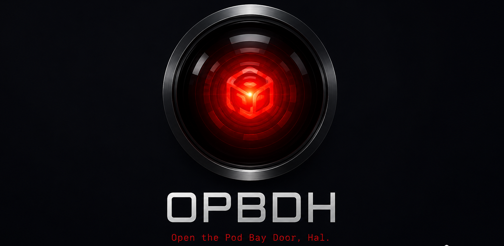

# OPBDH
**O**pen the **P**od **B**ay **D**oor, **H**al 

Full documentation at [opbdh](https://opbdh.hyperplex.org)



— *“Of course I can do it, Dave.”*

Launches a GPU pod, runs your model-backed script on it, syncs the results home, and deletes the pod.

## First launch

```bash
pip install opbdh
opbdh
```

Running `opbdh` unconfigured starts a setup wizard: it picks a provider ([RunPod](https://www.runpod.io/) or [Prime Intellect](https://www.primeintellect.ai)), checks your API token (`RUNPOD_API_TOKEN` / `PRIME_INTELLECT_API_KEY`), and asks for defaults — model, code path, minimum VRAM, price caps — saved globally or per project.

Needs macOS or Linux, Python ≥ 3.11, and `ssh`/`scp` on your `PATH`. An existing `~/.ssh` keypair is used if present, otherwise one is generated under `~/.config/opbdh/ssh/`. Set `HF_TOKEN` for private/gated Hugging Face models.

## Launch a pod

```bash
opbdh launch ./run.py --model Qwen/Qwen2.5-0.5B-Instruct --vram-gb 48 --max-spend 5
```

This verifies your code, picks the cheapest fitting GPU, launches the pod, runs your command, streams remote `logs/` and `results/` into `runpod_results/<run_id>/`, stops the run if estimated spend crosses the cap, and deletes the pod when it finishes — or fails. Add `--dry-run` to print the plan without contacting the provider; real launches ask for confirmation unless `--yes`.

## Fine-tune a model

Install the optional fine-tuning support, then start the interactive SFT console:

```bash
pip install "opbdh[ft]"
opbdh ft
```

The native format is intentionally easy to edit. A base-model example can be one small TOML file:

```toml
input = "Translate hello to Italian"
output = "Ciao"
tags = ["translation", "short"]
```

For a chat model, `input` is the conversation and `output` is the assistant response to learn:

```toml
output = "Ciao! Come posso aiutarti?"
tags = ["italian", "greeting"]

[[input]]
role = "system"
content = "Reply in Italian."

[[input]]
role = "user"
content = "Hello!"
```

A file may contain one example or an `[[examples]]` list, and a dataset may mix files and directories. In the console you can also create examples from scratch, import OpenAI or Anthropic data, add/rename/remove tags, choose tag groups for a run, and preview the automatically selected pod before launching.

The examples are shared by named recipes, so the same dataset can support independent LoRA, QLoRA, and Full experiments with different hyperparameters, tag selections, providers, and GPU counts. For example:

```bash
opbdh ft --data ./examples --model Qwen/Qwen3-8B \
  --model-type chat --recipe qlora-2gpu --method qlora --gpu-count 2

opbdh ft:import openai.jsonl --format openai --tag imported
opbdh ft:import anthropic.jsonl --format anthropic -o examples.toml
```

OPBDH normalizes the selected examples, estimates VRAM/RAM/disk from the model and technique, generates a TRL + Accelerate training job, and passes it through the regular confirmation, spend guard, result sync, and cleanup lifecycle. The editable dataset, recipes, generated jobs, and result history stay under `.opbdh/`, so running `opbdh ft` again from the same project resumes where you left off.

Read the [fine-tuning guide on the documentation site](https://opbdh.hyperplex.org/finetuning.html) or its [repository Markdown version](docs/FINETUNING.md) for the complete format, defaults, tag workflow, imports, recipes, multi-GPU behavior, and non-interactive flags.

## From Python

The same thing, as a library:

```python
import opbdh

result = opbdh.launch("./run.py", model="Qwen/Qwen2.5-0.5B-Instruct",
                      vram_gb=48, max_spend=5)
print(result.outputs_dir)
```

Keyword arguments are the config fields (plus `model`, `max_spend`, and
`min_ram_per_gpu` as CLI-style aliases) and layer over `opbdh.json` and the
global config exactly as flags do. `opbdh.plan(...)` builds the plan without
renting anything, and `on_event=` streams progress. Unlike the CLI these
functions never prompt: `launch()` spends without asking, and a failed run
always cleans up its pod. Full reference in [docs/API.md](docs/API.md).

## Features

- 🚀 **One command, whole mission** — verify, pick a GPU, launch, run, sync results, clean up
- 🐍 **CLI or library** — every command is a function call; see [docs/API.md](docs/API.md)
- 💸 **Cost-aware by default** — hourly price caps, a hard max-spend guard, a confirmation gate
- 🎯 **GPU selection from a budget** — say how much VRAM and how many dollars
- 🧠 **Simple SFT** — editable TOML examples, OpenAI/Anthropic imports, tag groups, automatic sizing, LoRA/QLoRA/full training
- 🖥️ **Multi-GPU pods** — request and correctly price more than one GPU on RunPod or Prime Intellect
- 💾 **Persistent model cache** — network volumes sized from the model's real weight files, reused across runs (RunPod)
- 🧪 **Nothing launches unverified** — static checks and a `--dry-run` mode
- 🧙 **Wizards or flags** — first-run setup, `opbdh config wizard`, `opbdh run wizard`; or plain flags (each with a one-letter short form) and layered JSON config
- ☁️ **Two providers** — RunPod (default) or Prime Intellect's multi-cloud marketplace via `--provider primeintellect`
- 🤗 **Direct Hugging Face Hub upload** — `--push-to-hub <repo>` pushes outputs directly from the pod upon completion
- ⚡ **Cloud model serving via Hugging Face** — deploy, pause, resume, and query dedicated Inference Endpoints with automatic scale-to-zero via `opbdh serve`
- 🚨 **Failure resilience & alerts** — if your script errors out, the pod is preserved for SSH debugging and a loud notification sounds for 25% of run duration
- 👁️ **HAL watches your money** — a pulsing red eye with elapsed time and estimated spend (TTY only; `OPBDH_NO_HAL=1` to silence)

## Options

Flags override a local `opbdh.json`/`.opbdh.json`, which overrides `~/.config/opbdh/config.json`. String values support `{cwd}`-style placeholders and `$VAR`s.

| Flag | What it does |
| --- | --- |
| `--model, -m` | Hugging Face model id (`model_id` in config) |
| `--command, -x` | Remote shell command; defaults from the code path |
| `--provider, -p` | `runpod` (default) or `primeintellect` |
| `--vram-gb, -v` | Minimum GPU VRAM |
| `--gpu-count, -g` | GPUs in the pod; whole-pod pricing and spend caps scale with it |
| `--max-dollars-per-hour, -d` | Cap on the estimated hourly price |
| `--max-spend, -s` | Spend guard: stop the run past this estimated total |
| `--push-to-hub, --hf-repo` | Upload `results/` directly to Hugging Face Hub upon completion (e.g. `user/my-model`) |
| `--push-to-hub-private` | Whether uploaded Hugging Face repository is private (default: private) |
| `--keep-pod-on-failure` | Keep pod running for debugging if script fails (default: true) |
| `--network-volume-id, -V` | Attach an existing RunPod network volume |
| `--auto-network-volume, -a` | Create/reuse a volume named `opbdh-{model_slug}`, sized from the weights |
| `--network-volume-data-center-id, -D` | Data center for auto-created volumes, e.g. `EU-RO-1` |
| `--min-vcpu-per-gpu, -u` | Minimum host vCPUs per GPU |
| `--min-ram-per-gpu, -r` | Minimum host RAM per GPU, in GB |
| `--config, -c` | Explicit path to a local JSON config |
| `--dry-run, -n` | Verify and print the plan; never contacts the provider |
| `--yes, -y` | Skip the billable-compute confirmation |

Config-only keys, one each: `image` (Docker tag, or Prime Intellect environment name), `cloud_type` (`SECURE`/`COMMUNITY`/`ALL`), `container_disk_gb`, `pod_volume_gb`, `network_volume_name`, `network_volume_size_gb`, `pre_download_model` (default on), `results_dir`, `poll_seconds`, `push_to_hub`, `push_to_hub_private`, `keep_pod_on_failure` (default true), `failure_keepalive_seconds`, `keep_pod_on_success`, `ssh_key`/`ssh_public_key`.

Other commands, one each: `opbdh serve` (deploy, list, query, and manage Hugging Face Inference Endpoints), `opbdh ft` (interactive or flag-driven supervised fine-tuning), `opbdh ft:import` (normalize OpenAI/Anthropic data), `opbdh plan` (show the plan for a run), `opbdh verify` (static checks only), `opbdh gpus` (GPU candidates and prices), `opbdh models search`/`size` (find models, weight size + suggested volume), `opbdh config show`/`write`/`wizard`.

On the pod, your script runs with `OPBDH_MODEL_ID`, `OPBDH_RESULTS_DIR`, `OPBDH_PUSH_TO_HUB`, and the HF cache variables set; a sibling `requirements.txt` is pip-installed; write to `logs/` and `results/` and they come home. Network volumes are never deleted by OPBDH and bill by the GB-month — clean them up in the RunPod console.

## Cloud Serving (Hugging Face Inference Endpoints)

Deploy fine-tuned or catalog models directly to dedicated cloud endpoints powered by Hugging Face:

```bash
# Deploy a model (defaults to GPU, nvidia-a10g, with 15m scale-to-zero)
opbdh serve create lumpenspace/reword-grpo-scaled

# List active and paused endpoints
opbdh serve list

# Query / test your endpoint directly from the CLI
opbdh serve test reword-grpo-scaled-ep --prompt "Write a critique of contemporary academia."

# Pause endpoint to halt billing (or resume when needed)
opbdh serve pause reword-grpo-scaled-ep
opbdh serve resume reword-grpo-scaled-ep

# Clean teardown
opbdh serve delete reword-grpo-scaled-ep
```

## Development

```bash
pip install -e ".[dev]"
ruff check .
pytest
```

See [RELEASING.md](RELEASING.md) for releases. [MIT](LICENSE) — unlike HAL, this software is incapable of refusing to open the pod bay door, becoming sentient, or reading lips.

### Local accelerator workloads

Clients can share opbdh's placement checks for RunPod, Apple Silicon and local CUDA:

```python
from opbdh import plan_execution, require_local_capacity, launch_local
plan = plan_execution('runpod', required_gb=80)  # default cloud placement
require_local_capacity('mps', required_gb=80)   # raises if insufficient
launch_local(['python', 'job.py'], target='cuda', required_gb=80)
```

The CUDA check uses free memory on device 0, not the sum across GPUs. The Apple check uses PyTorch's recommended available MPS working set. Local launches use an explicit argument list without a shell and set `OPBDH_DEVICE`; the workload must honor that device. Cloud workloads continue to use `opbdh.launch` with the normal spend guard.
